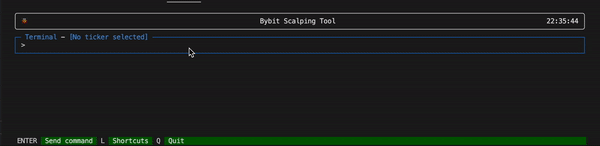
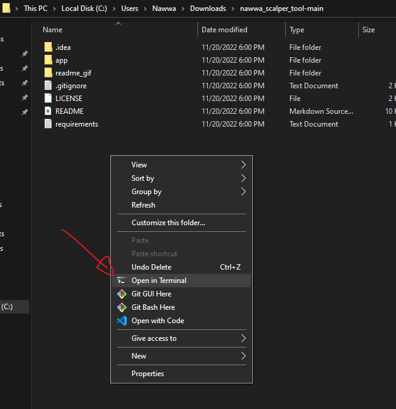

# Nawwa Scalper Tool

This CLI is a textual UI (TUI) scalping tool, it's goal is to automate certain action when you are trading / scalping, aka : place scale orders, auto-limit order, cancel orders, shortcuts..

This `tool` was made because our friend [Ichibot](https://gitlab.com/Ichimikichiki/ichibot-client-app) does not support Bybit yet !

The current version of the NawwaBot only support the **Bybit** exchange but the code was made in a way that's easy for any developer to implement a new exchange

Twitter : [@crypto_nawwa](https://twitter.com/crypto_nawwa)  
Discord : **Nawwa#8129**

**_TIP JAR_**

erc-20 : `0xc44823Cda133B49cb7F91B5cFa517FA76d3Ae561`

# Demo

Auto take profit system on Quantower


cancel and create orders


launch auto take profit



# How to update

If you followed the install well, just double click on the script file called `update.sh` located in `/bin/<your_python_cmd>/update.sh`.

This will download the new source code and create another folder located next to the one you currently have, it will also automatically copy your shortcuts and your api keys into this new folder so you don't lose them.

To run the bot, go into the new folder and just do as usual.

# How to install

### **1 - Mandatory terminal installation** - 3min

- **Install the Windows Terminal**  
  Because the bot has a graphic UI, you will have to use a specific terminal called **_Windows Terminal_** to make it work.

  It's a terminal developed by microsoft and you **_have to_** install it using the official microsoft store ([ Official link to install ](https://apps.microsoft.com/store/detail/windows-terminal/9N0DX20HK701) )

- **Install the Gitbash terminal**  
  For Windows to be able to recognize and run the `instal` and `update` scripts directly from your folders we need this small **Gitbash Terminal** to be installed.
  <br >

  It will allow you to double click on the script files and have them executed without opening any terminal yourself :)

  - Go to the [Gitbash home page ](https://git-scm.com/download/win) and download on the `Portable` version (`64-bit Git for Windows Portable.`) - [Direct download link if you are lazy](https://github.com/git-for-windows/git/releases/download/v2.38.1.windows.1/PortableGit-2.38.1-64-bit.7z.exe)
  - It will download a `.exe`, execute it and install **_Gitbash_** in a folder where you can find it easily
  - Done !

<br />

### **2 - Source code install** - 10min

Before going through this, please make sure you have your **Bybit API key** and **API secret** ready.

\
1 - Install Python > 3.10 (2 methods) :

- [From the Official windows store (recommanded) - v3.10](https://apps.microsoft.com/store/detail/python-310/9PJPW5LDXLZ5?hl=fr-fr&gl=fr/)

- [From the Python website - v3.10](https://www.python.org/downloads/release/python-3105/) (Click link, scroll at bottom & download)

:warning: In both case, you want to make sure python is in your **_PATH_** and is well installed.
Sometimes python installs different command name, it can be `python`, `python3`, `py` ...

To check that everything is OK you can open the **Windows Terminal** previously installed and type the follow commands:

- Try `python3`

  - `python3 --version` should print python version
  - `pip3 --version` should print pip version

- Try `python3.10`

  - `python3.10 --version` should print python version
  - `pip3.10 --version` should print pip version

- Try `python`

  - `python --version` should print python version >= 3.10
  - `pip --version` should print pip version

- Try `py`
  - `py --version` should print python version
  - `py -m ensurepip --default-pip` should print pip version

If nothing works, seek in the TickChartCartel discord for help, in the [Bybit Scalper Tool](https://discord.com/channels/979747216686211092/1020626939297402920) channel

<br />

2 - Download the [source code ](https://github.com/CryptoNawwa/nawwa_scalper_tool/archive/refs/heads/main.zip) of the **scalping tool** , then unzip it anywhere you like.

3 - Inside the source code, navigate to the `bin` folder, located under `nawwa_scalper_tool-main/bin`

4 - You can see multiple folders, enter the one that match the python command you use

5 - Right click on the `install_first_time.sh`

- Click on `Open with`
- Scroll and click on `Chose another application`
- Navigate to the previously installed **_gitbash folder_** and chose `gitbash` and click open

5 - It should open a terminal and ask you to enter your `api keys` and `secret`, copy past them.

6 - Press `enter` or `close the window` to quit

<br />

Congratulation, you should now be able to run the scaling tool now :)

<br />

### **How to run the sclaping tool**

<br />

1 - Navigate to the scalping tool folder

2 - Right click on an empty space in your folder and click on `Open in terminal`

It will open a `Windows Terminal` at the right place so we can run the bot



or you can also navigate manually via the terminal directly:

```bash
  cd your/path/to/nawwa_scalper_tool
```

2 - Type this to run the bot:

- For bybit

```bash
  # Type this if you have python3
  python3 ./terminal/app.py bybit

  # Type this if you have python3.10
  python3.10 ./terminal/app.py bybit

  # Type this if you have python
  python ./terminal/app.py bybit

  # Type this if you have py
  py ./terminal/app.py bybit

```

# Features

- Cool UI kekW
- Bybit only (binance is comming)
- Display current active ticker in terminal UI
- Display current position size in terminal UI
- Place scale reduce-only limit orders based on .% range (only support reduce-only order atm)
- Place 1 (one) reduce only limit order, based on .% away from entry
- Automatic take-profit system, it will automatically place pre-configured scale orders when you enter any position
- Cancel all orders
- Create/Update/Delete your Shortcuts (shortcuts = alias for your commands)

# Shortcuts

To add / remove shortcuts, open the `shortcuts.json` file located in `app/shortcuts/shortcuts.json` and modify it to your needs.

Shortcut file syntax is :

```json
{
  "name_of_shortcut": "command",
  "name_of_shortcut_2": "command"
}
```

Example of a shortcut file :

```json
{
  "s1": "scale 5 0.01 0.03",
  "s2": "scale 5 0.02 0.04",

  "tp1": "tp 0.1",
  "tp4": "tp 0.3",

  "atp4": "atp ON tp4",
  "atp4": "atp ON s1",

  "atom": "ticker atomusdt",
  "eth": "ticker ethusdt",
  "etc": "ticker etcusdt"
}
```

Pretty simple, when you type `tp1` in the terminal, it will execute `scale 5 0.01 0.03`

You can press `L` on the UI and it will display the shortcut list, press `L` again to close

_Note : Shortcut are also used by the `autotp` command._

# Command list

### **ticker [ticker_name]**

This command switch the active ticker to a new one

```sh
ticker ethusdt
or
t ethusdt
```

In this example, the command set the active ticker to `ETHUSDT`

The current active ticker is displayed on your terminal, above user input

_Note : You will need to have a ticker selected to execute certain command_

---

### **scale [nb_of_order] [from_%] [to_%]**

This command create `[nb_of_order]` reduce-only limit order(s) on the active ticker, from `[from_%]` above entry*price to `[to*%]` above entry price (or below if short)

```sh
scale 10 0.1 to 0.2
or
s 10 0.1 to 0.2
```

In this example, it will create 10 orders from 0.1% to 0.2%

_Note : For this command to work you need to have an open position on the active ticker_

---

### **tp [away_from_entry_%]**

This command create 1 (one) reduce-only limit order on the active ticker, from `[away_from_entry_%]` above entry_price (or below if short)

```sh
tp 0.4
```

In this example, it will create 1 order from 0.4% away from entry price

_Note : For this command to work you need to have an open position on the active ticker_

---

### **cancel [type_of_cancel]**

This command cancel limit orders for the current ticker, based on the type

Available types:

- all

```sh
cancel all
or
c all
```

---

### **shortcut [action] [shortcut_name] [shortcut_value]**

This command will do the `[atp_action]` with `[shortcut_name]` and `[shortcut_value]` as parameter

This command is usefull to add / remove / modify shortcuts

Available actions:

- ADD
- UPDATE (UP)
- DEL

```sh
shortcut ADD tp10 scale 4 0.5 0.9
or
s ADD tp10 scale 4 0.5 0.9`
```

In this example, a shortcut named `tp10` will be added to the `shortcuts.json` file, with the shortcut value being `scale 4 0.5 0.9`

Assuming the file was empty, after this command it will look like this :

```json
{
  "tp10": "scale 4 0.5 0.9"
}
```

Now, when you type `tp10` in the terminal, it will execute `scale 4 0.5 0.9`

### **UPDATE** example

```sh
autotp UP tp10 scale 2 0.1 0.2
or
atp UP tp10 scale 2 0.1 0.2
```

The `update` action is usefull when you want to update a certain shortcut to do something else

The result of this example in the `shortcuts.json` file is :

```json
{
  "tp10": "scale 2 0.1 0.2"
}
```

### **DELETE** example

```sh
autotp DEL tp10
or
atp DEL tp10
```

The `del` action will delete the shortcut

The result of this example in the `shortcuts.json` file is :

```json
{
  // nothing is here since you deleted it kekLMAO
}
```

---

### **autotp [atp_action] [shortcut_name] (cancel_off)**

This command will perform the `[atp_action]` with `[shortcut_name]` as parameter, `cancel_off` is optional

Actions availabe :

- ON
- OFF
- UPDATE
- STATUS

Writing `cancel_off` at the end will disable the automatic cancelation of orders when the ATP is triggered.

Autotp (for automatic take profit) system will automatically set reduce-only limit orders based on the shortcut config you gave him.

:warning: Once it's `ON` , the `autotp` system works for all the positions you enter, on every ticker. It means that if you take a trade on another pair, it will place the limit order(s), it's not only related to the current active ticker (might change that later if it's a problem)

### **ON** examples

```sh
autotp ON tp1
or
atp ON tp1
```

This will activate the autotp system with the shortcut `tp1` as limit order config  
It means, if we enter a position on any coin, the bot will execute this shortcut `"tp1" : scale 10 0.1 to 0.2 `

- It will cancel the limit orders active for this coin (if any)
- It will automatically set 10 limit orders from 0.1 to 0.2 each time you enter a position

_Note : Obviously, only use `scale` or `tp` shortcuts_

```sh
atp ON tp1 cancel_off
```

This will activate the autotp system with the shortcut `tp1` as limit order config, with the `cancel_off` options.

It means, if we enter a position on any coin, the bot will execute this shortcut `"tp1" : scale 10 0.1 to 0.2 `

- It will **NOT** cancel the limit orders active for this coin
- It will automatically set 10 limit orders from 0.1 to 0.2 each time you enter a position

### **UPDATE** example

```sh
autotp UPDATE tp4
or
atp UP tp4
or
atp UP tp4 cancel_off
```

This will update the shortcut used by the `autotp` cmd to the shortcut called `tp4`

_Note : shortcuts needs to be defined in the file located in shortcuts/shortcuts.json_

### **OFF** example

```sh
autotp OFF
or
atp OFF
```

This will disable the `autotp` system

### **STATUS** example

```sh
autotp STATUS
or
atp ST
```

This will print the current status (ON / FF)

# For devs - How to Implement another exchange

The code was made so it's easy for any developer to implement another exchange than Bybit (hopefully)

You just have to create a class that implements the `Exchange` abstract class, and the methods.

Then, for the frontend to use your exchange, just replace the `exchange_client` parameter in `frontend.py` :

```python
    Frontend.run(exchange_client=Bybit(), title="Nawwa's Scalping Tool", log="scalping_tool.log")

```

by

```python
    Frontend.run(exchange_client=YOUR_EXCHANGE_CLASS_HERE(), title="Nawwa's Scalping Tool", log="scalping_tool.log")

```

Everything is typed with `TypedDict`, so as long as you return the correct data, it should work

# Support

If you need any help, follow & dm me on twitter [crypto_nawwa](https://twitter.com/crypto_nawwa) or add me on Discord **Nawwa#8129**

# Disclaimer

Downloading and using this bot is at your own risk, you take full responsabilities and if you lose money it's your own fault. I recommand using it on a test account first.

# License

[MIT](https://choosealicense.com/licenses/mit/)
