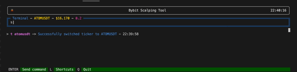

# A Bybit Scalper Tool


## Wat iz it ?
I built this little piece of code so we can finally do like the big boys on binance and exit our 0.2 ETH position with 2 scale orders.

Incredible

It's my first time building something in python so please don't insult me on twitter, there is probably 100 better ways to organize the code and I'm sure it could be more efficient, but it works so as a good friend would say, heh


## Features



- scale order (reduce only, used as TP)
- cancel orders
- automatic take-profit (will place pre-configured scale orders when you enter a position)
- cool UI
- shortcuts

## Shortcuts

To add / remove shortcuts, ppen the shortcuts.json file under data/ and modify it to your needs.

Shortcut syntax is :
```json
{
    "name_of_shortcut" : "command",
    "name_of_shortcut_2" : "command"
}
```

Example of a shortcut file : 
```json
    "tp1": "scale 5 0.01 0.03",
    "tp2": "scale 5 0.02 0.04",
    "tp3": "scale 5 0.03 0.06",
    "tp4": "scale 2 0.01 0.02",
    "atp4": "atp ON tp4",
    "atom" : "t atomusdt",
    "eth" : "t ethusdt",
    "etc" : "t etcusdt"
```

Pretty simple, when you type ```tp1``` in the terminal, it will execute `scale 5 0.01 0.03`

You can press `L` on the UI and it will display the shortcut list, press `L` again to close

Note : Shortcut are also used by the `autotp` command.

## Available commands
---

### **ticker [ticker_name]**


This command switch the active ticker to ETHUSDT

Note : you need to have a ticker selected to execute certain command
```sh
ticker ethusdt
t ethusdt
```

---

### **scale [nb_of_order] [from_%] [to_%]**

Will create take-profit limit order (reduce only) to exit the current position on the active ticker, from `from_%` above entry_price to `to_%` above entry price (or below if short)

```sh
scale 10 0.1 to 0.2
s 10 0.1 to 0.2
```
---
### **cancel [type_of_cancel]**

Will cancel limit orders for the current ticker, based on the type

Types: 
- all


```sh
cancel all
c all
```
---
### **autotp [action_to_do] [shortcut_name]**

Will do the action on the autotp system

Autotp (for automatic take profit) system will automatically set TP orders based on the shortcut config you gave him.  
It runs for **ALL THE COIN**, even if you switch ticker or switch tab it will run the system, it's not related to the current active ticker (might change that later)

Actions availabe : 
- ON
- OFF
- UPDATE
- STATUS


### **ON** example
```sh
autotp ON tp1
atp ON tp1
```
This will activate the autotp system with the shortcut `tp1` as scaling order config  
It means, if `"tp1" : scale 10 0.1 to 0.2 ` the bot will automatically set 10 limit orders from 0.1 to 0.2 each time you enter a position

Note : Obviously, Only use scale order shortcuts

### **UPDATE** example
```sh
autotp UPDATE tp4 
atp UP tp4
```
This will update the shortcut used buy the bot to the shortcut called `tp4`

Note : shortcuts needs to be defined in the file located in data/shortcuts.json

### **OFF** example
```sh
autotp OFF 
atp OFF
```
This will disable the autotp system

### **STATUS** example
```sh
autotp STATUS 
atp ST
```
This will print the current status (ON / FF)


## Tech
I used a number of open source projects to make it work properly:

- [Textual] - TUI plugin, based on Rich
- [Pybit] - Bybit python connector
- [Baywatch] - I just copy pasted the config part, I put him here to give credit
- [TextualListView] - Custom Texual widget list
- [TextInput] - Custom Text input widget  


## Installation & setup


**MacOS / LINUX**  
Use any terminal

**Windows**  
Because it's a graphic UI, you will need to use a specific terminal called [Windows Terminal](https://apps.microsoft.com/store/detail/windows-terminal/9N0DX20HK701?hl=fr-fr&gl=fr). It's a terminal developed by microsoft and you can install it using the microsoft store. Do that first.


Requires :

- [Python 3.10](https://www.python.org/downloads/release/python-3105/) (Scroll at bottom & download)
- [Git](https://git-scm.com/downloads) 

When you have Python & Git installed, open the terminal and install the dependencies using pip or pip3


```sh
pip3 install textual
pip3 install textual-inputs~=0.2.6
pip3 install git+https://github.com/Cvaniak/TextualListViewUnofficial.git 
pip3 install pybit
```

Fist, launch config UI so you can put your Bybit API keys:

```sh
python3 app.py -c
```

To launch the bot, just do : 

```sh
python3 app.py
```


## General info & disclaimer
This bot was quickly written to suit my needs, it's not a fully functional product aiming to be the ichibot of bybit, it's a side project cause I love to code, treat it like so <3  

If you want the hotkeys "L" to work you will need to click around the text input to lose the focus so the UI can detect your keystroke, annoying I know, you can also click on the `L` directly, with your mouse.

Use it a your own risk, it's a random piece a code made by a stranger on the internet, by downloading this you take full responsibility, if you use this and lose money i'm not responsible, use it with care.

## License

MIT


   [Textual]: <https://github.com/Textualize/textual>
   [PyBit]: <https://github.com/bybit-exchange/pybit>
   [BayWatch]: <https://github.com/hdb/baywatch>
   [TextualListView]: <https://github.com/Cvaniak/TextualListViewUnofficial>
   [TextInput]: <https://github.com/sirfuzzalot/textual-inputs>
